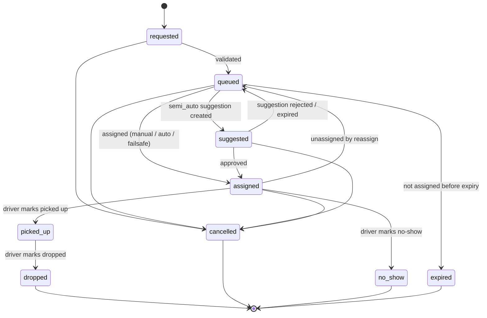
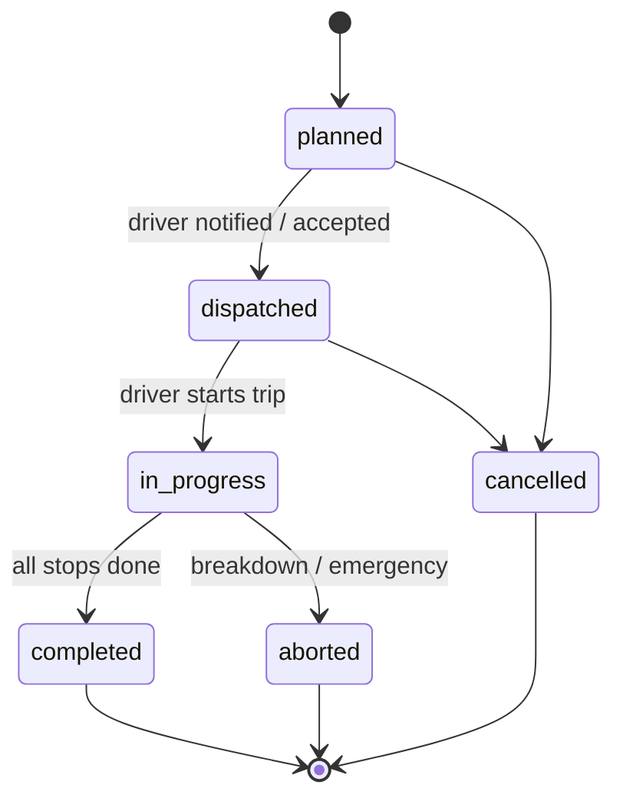

# Trip lifecycle (state machines)

All status changes go through the state machine service (`backend/app/domain/state_machines.py`). Direct writes to status columns are forbidden. Every transition writes an event row (`ride_request_event`, `trip_event`) with actor, time and reason.

## 1. Ride request states

| State | Meaning |
|---|---|
| `requested` | Created, not yet validated. |
| `queued` | Valid and waiting for assignment (includes hold window for pooling). |
| `suggested` | Semi-auto: suggestion shown to supervisor, awaiting decision. |
| `assigned` | Linked to a trip and vehicle; employee notified. |
| `picked_up` | Rider on board. |
| `dropped` | Rider delivered. Terminal. |
| `no_show` | Rider absent after wait time. Terminal. |
| `cancelled` | Cancelled by employee, supervisor or system. Terminal. `cancel_reason` required. |
| `expired` | Not assigned within `request_expiry_minutes` after requested time (default 120). Terminal; supervisor alerted before expiry. |

Rules:
- `assigned → queued` only via supervisor reassign/unassign or trip cancellation; the employee is notified.
- Employee cancel is allowed until `picked_up`; after the stop is `arrived`, a reason is required.
- `no_show` requires stop status `arrived` for at least `no_show_wait_minutes`.
- A locked request (`lock_vehicle_id` set) can only change vehicle through a supervisor override.

## 2. Trip states

| State | Meaning |
|---|---|
| `planned` | Created with stops; may still change (add/remove riders, re-order) unless locked. |
| `dispatched` | Sent to driver. Changes still allowed with notifications. |
| `in_progress` | Driver started. Only additions that pass detour rules, or supervisor overrides. |
| `completed` | All stops done. |
| `cancelled` | Before start. All non-terminal requests return to `queued`. |
| `aborted` | Stopped mid-way. Riders not yet dropped get new handling by supervisor; alert raised. |

## 3. Stop states
`pending → en_route → arrived → done` or `arrived → skipped` (no-show / cancelled rider).
- A pickup stop's `done` sets its request to `picked_up`; a drop stop's `done` sets it to `dropped`.
- Stops carry `planned_eta`, `latest_eta` (updated), `arrived_at`, `done_at`, GPS at each event.

## 4. Vehicle / driver states
| State | Meaning |
|---|---|
| `off_duty` | Not assignable, no GPS. |
| `available` | On duty, no active trip. |
| `on_trip` | Has a dispatched or in-progress trip. |
| `out_of_service` | Breakdown or supervisor action. Not assignable. |
| `stale` (derived) | On duty but no GPS for > `stale_gps_seconds` (default 60). Shown as warning; not assignable automatically. |

## 5. Time fields
All timestamps stored in UTC (`timestamptz`). Displayed in Asia/Kolkata. "Now" always comes from the injected `Clock`.

## 6. Events and notifications
| Transition | Notify |
|---|---|
| request → assigned | Employee (push), driver (push) |
| stop ETA ≤ 5 min | Employee |
| stop → arrived | Employee |
| request reassigned | Employee (new cab), old driver, new driver |
| request cancelled by employee | Driver (if assigned), supervisor |
| request cancelled by operator | Employee (with reason) |
| request near expiry (15 min before) | Supervisor |
| trip aborted, SOS | Supervisor, operator admin (high priority) |
