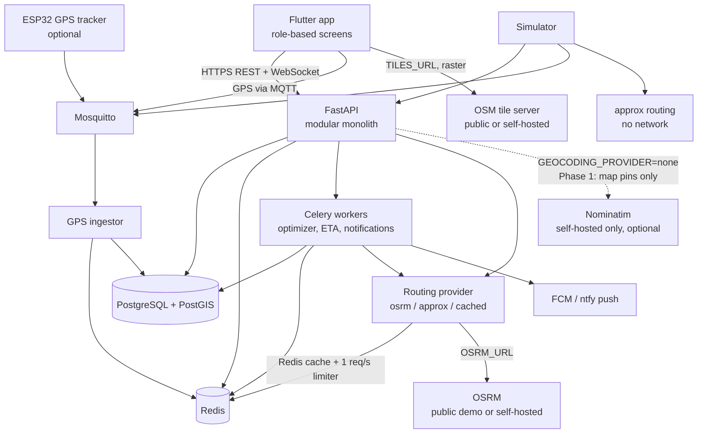
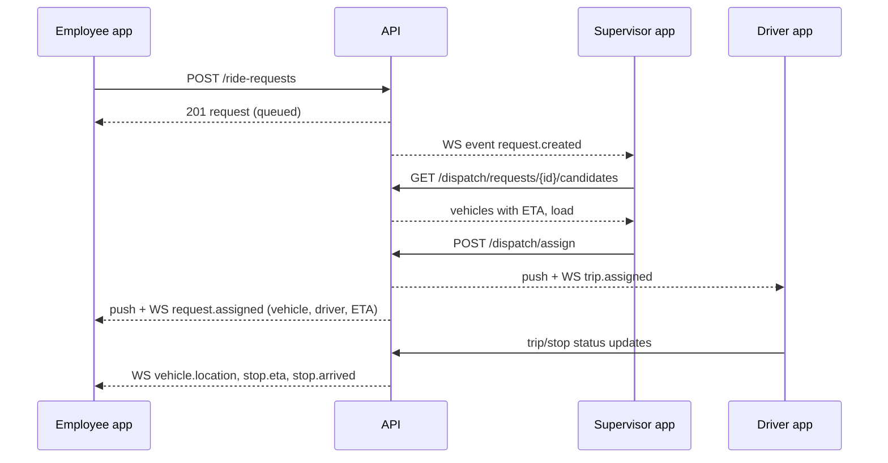

# Architecture

## 1. Overview
A **modular monolith** backend (FastAPI) with background workers, a single universal Flutter app, and OpenStreetMap map services. A closed-loop simulator talks to the same API and MQTT broker as real apps.

Map services are reached through URLs from config (`OSRM_URL`, `TILES_URL`): the **public OSM servers** in early phases, self-hosted containers later, with no code change (ADR-0010). There is **no geocoding in Phase 1** — locations come from map pins + landmark text, and public Nominatim is never called (ADR-0010 §A1).

The `routing` module is the **only** part of the system that talks to OSRM. The app calls no map service
except the tile server: it fetches raster tiles from `TILES_URL` with its own `User-Agent`
(`flex-platform/<version> (contact: <OSM_CONTACT_EMAIL>)`), caches them for at least 7 days, never prefetches
or downloads them for offline use, and shows "© OpenStreetMap contributors" bottom-right at all times.
Geocoding is behind a `GeocodingProvider` interface whose Phase 1 implementation is `none`.

## 2. Backend modules
`backend/app/modules/<name>/` each with `router.py`, `schemas.py`, `service.py`, `repository.py`, `models.py`.

| Module | Responsibility |
|---|---|
| `auth` | OTP login, tokens, roles, active role, permissions |
| `tenancy` | Operators, clients, offices, users |
| `fleet` | Vehicles, drivers, duty state |
| `people` | Employees, CSV import, saved places |
| `requests` | Ride requests, validation, cancellation |
| `trips` | Trips, stops, state machines, driver actions |
| `dispatch` | Candidates, manual assignment, suggestions, modes, overrides, failsafe, pause |
| `optimizer` | Cost function, single insertion, OR-Tools batch solver (Phase 3) |
| `routing` | Routing provider interface (`osrm`, `approx`, `cached`) selected by `ROUTING_PROVIDER`; ETA service, speed profiles; shared Redis rate limiter for public servers; `GeocodingProvider` interface (`none` in Phase 1; self-hosted Nominatim only) |
| `tracking` | GPS ingestion, live positions, stale detection, WebSocket fan-out |
| `notifications` | Push (FCM/ntfy), in-app notification records |
| `alerts` | SOS, driver issues, expiry, failsafe, mode prompts |
| `reports` | Metrics, CSV export, billing export |
| `config` | Operator config keys with validation and audit |
| `audit` | Audit log |
| `simctl` | Sim-only: clock control, seeding (enabled only when `APP_ENV=sim`) |
| `prediction` | Phase 4: demand and ready-time models, offers |

Rules:
- Modules talk through **service interfaces**, never another module's repository or tables directly.
- Domain logic (state machines, cost function, hard rules) lives in pure functions in `backend/app/domain/` with no I/O, so it is unit-testable and reused by the simulator's analysis tools.

## 3. Key flows

### 3.1 Employee requests a cab (Phase 1, manual)

### 3.2 GPS pipeline
1. Driver app publishes to MQTT every 5 s (moving) / 30 s (stationary).
2. `tracking` ingestor (a separate process subscribed to Mosquitto) validates the device, writes the latest position to Redis (`veh:{id}:pos`), appends to `location_ping` in batches (every 5 s), and publishes an internal event.
3. WebSocket hub pushes position to subscribed supervisors and to the employee of the active trip.
4. ETA worker recomputes active stop ETAs every 30 s via the routing provider (cached; falls back to `approx` when rate-limited or OSRM is down, and marks the ETA approximate).
5. Nightly job aggregates pings into `road_speed_profile`; weekly job regenerates OSRM speed files (Phase 1 late / Phase 2).

### 3.3 Clock
- Backend code gets time from `Clock` (dependency-injected). `SystemClock` in dev/prod; `SimClock` in `APP_ENV=sim` controlled by `/simctl/clock`.
- Celery schedules and timeouts (failsafe, expiry) use the clock via a scheduler loop that checks due items, not wall-clock `sleep`, so the simulator can accelerate time.

### 3.4 Routing and degradation
- One provider interface, three implementations, chosen by `ROUTING_PROVIDER`:
  - `osrm` — HTTP calls to `OSRM_URL` (public demo server or self-hosted).
  - `approx` — no network: haversine distance × road factor 1.4, speed from a time-of-day table in config.
    Always available; results carry `approximate: true`.
  - `cached` — wraps either of the above and caches route/table results in Redis (TTL from config).
- **Rate limit for public servers:** a Redis token bucket allows 1 request/second per service across *all*
  processes (API workers, Celery workers, beat). A call that cannot get a token does not queue — it is served
  by `approx` and flagged approximate.
- **Identification:** every request to a public server carries a `User-Agent` built from `OSM_USER_AGENT` and
  `OSM_CONTACT_EMAIL`.
- **Geocoding:** none in Phase 1 (`GEOCODING_PROVIDER=none`). Public Nominatim is never called — its policy
  forbids vehicle-tracking applications. Locations come from map pins + landmark text; a self-hosted
  Nominatim may be added later behind the same interface (task I02c), backend-only and cached.
- **Bulk callers:** the simulator and the optimizer use `approx`, or a self-hosted OSRM if `OSRM_URL` points
  at one. They never drive load onto the public servers.
- **Degradation ladder** (consistent with `control-model.md`): `cached` hit → `osrm` call → rate-limited,
  timing out or down → `approx`, flagged approximate in the API and shown as approximate in the app.

## 4. Realtime
- One WebSocket endpoint `/ws` authenticated with the access token; clients subscribe to channels permitted for their role:
  - `operator.{id}.vehicles`, `operator.{id}.requests`, `operator.{id}.alerts` (supervisor/admin)
  - `trip.{id}` (employee of that trip, assigned driver)
  - `user.{id}` (personal notifications)
- Redis pub/sub connects API workers to the WebSocket hub so it scales to several API processes.

## 5. Deployment (pilot)
Single VM (India region), Docker Compose:
`caddy`, `api` (uvicorn, 2–4 workers), `ingestor`, `worker` (Celery), `beat` (scheduler), `postgres` (PostGIS), `redis`, `mosquitto`, `prometheus`, `grafana`.
Map services are **not** containers in early phases — the public OSM servers are used via `OSRM_URL` and
`TILES_URL`. Adding `osrm` and `tileserver` containers and repointing those two variables is the self-hosting
upgrade (task I02b), **required before the paid pilot** since the public services carry no SLA and may be
withdrawn for commercial use (OQ-21). A self-hosted `nominatim` container is separate and optional (I02c).
Environments: `dev` (local), `sim` (simulator + accelerated clock), `staging`, `prod`.

## 6. Scaling path
- More API workers behind Caddy; Redis pub/sub for WebSockets.
- Move `ingestor` to Go if GPS load exceeds ~1,000 msg/s.
- Split `optimizer` into its own service if solver runs block workers.
- Move from the public OSM servers to self-hosted OSRM **and tiles** before the paid pilot — a config change plus two containers (I02b, OQ-21).
- Kubernetes only at multi-operator scale (Phase 5).
