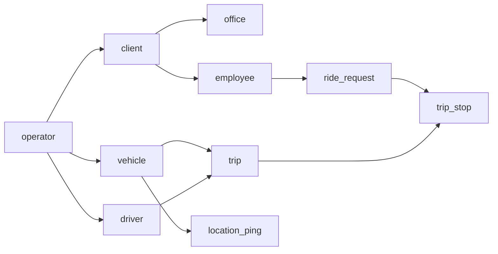

# Data model

PostgreSQL 16 + PostGIS. All tables have `id` (UUID v7 preferred, else v4), `created_at`, `updated_at` (timestamptz, UTC) unless noted. Tenant tables carry `operator_id` (FK, indexed) and every query filters by it.
Geometry: `geography(Point, 4326)` for points, `geography(Polygon, 4326)` for zones.

## Entity overview

## Tenancy and users
**operator** — `name`, `status` (`active`,`suspended`), `timezone` (default `Asia/Kolkata`), `automation_paused` bool.

**app_user** — `phone` (E.164, unique), `name`, `status`, `last_login_at`. (Not tenant-scoped; roles are.)

**user_role** — `user_id`, `role` (enum from roles doc), `operator_id` (nullable for platform_admin), `client_id` (for client_admin/employee), `employee_id` / `driver_id` (link to profile). Unique (user_id, role, operator_id, client_id).

**refresh_token** — `user_id`, `token_hash`, `expires_at`, `revoked_at`, `device_info`.

**otp_challenge** — `phone`, `code_hash`, `expires_at`, `attempts`, `consumed_at`.

**device** — `user_id`, `platform`, `push_token`, `app_version`, `last_seen_at`.

## Customers
**client** — `operator_id`, `name`, `contact_name`, `contact_phone`, `status`.

**office** — `operator_id`, `client_id`, `name`, `location` point, `address_text`.

**client_policy** — `client_id` (unique), `pooling_allowed` bool, `employee_opt_out_allowed` bool, `night_safety_enabled` bool, `night_start`, `night_end` (time), `max_detour_factor` (nullable, stricter only), `max_detour_minutes` (nullable), `pickup_window_minutes` (nullable), `no_show_wait_minutes` (nullable).

**employee** — `operator_id`, `client_id`, `user_id` (nullable until first login), `name`, `phone`, `office_id`, `home_location` point, `home_landmark`, `zone_id` (derived, nullable), `priority` smallint 1–10 (default 5), `is_vip` bool, `night_escort_required` bool, `active` bool.

**saved_place** — `employee_id`, `label`, `location`, `landmark`.

**zone** — `operator_id`, `name`, `area` polygon, `active`.

## Fleet
**vehicle** — `operator_id`, `registration_no` (unique per operator), `model`, `vehicle_type` (`sedan_4`,`suv_6`,`vip`), `seat_capacity` smallint, `status` (`off_duty`,`available`,`on_trip`,`out_of_service`), `current_driver_id` nullable, `mqtt_username`, `tracker_type` (`app`,`esp32`).

**driver** — `operator_id`, `user_id`, `name`, `phone`, `licence_last4`, `default_vehicle_id`, `active`.

**duty_session** — `driver_id`, `vehicle_id`, `started_at`, `ended_at`.

## Requests and trips
**ride_request** — `operator_id`, `client_id`, `employee_id`, `direction` (`to_office`,`from_office`), `office_id`, `location` point (home/pickup or drop), `landmark`, `requested_time` timestamptz, `urgency` (`high`,`medium`,`low`), `no_sharing` bool, `status` (see lifecycle), `channel` (`app`,`supervisor`,`offer`,`sim`), `created_by_user_id`, `trip_id` nullable, `lock_vehicle_id` nullable, `forced_priority` bool, `hold_until` nullable, `override_until` nullable, `cancel_reason` nullable, `expires_at`.
Indexes: (operator_id, status), (employee_id, requested_time), GIST(location).

**ride_request_event** — `request_id`, `from_status`, `to_status`, `actor_type` (`employee`,`driver`,`supervisor`,`system`,`system_failsafe`,`optimizer`), `actor_user_id`, `reason`, `at`, `data` jsonb.

**trip** — `operator_id`, `vehicle_id`, `driver_id`, `direction`, `office_id`, `status`, `pooling_blocked` bool, `planned_start`, `started_at`, `completed_at`, `planned_distance_m`, `actual_distance_m`, `empty_distance_m`, `mode_used` (`manual`,`semi_auto`,`full_auto`,`failsafe`), `route_geometry` linestring (nullable).

**trip_stop** — `trip_id`, `sequence` smallint, `stop_type` (`pickup`,`drop`), `request_id`, `location`, `status` (`pending`,`en_route`,`arrived`,`done`,`skipped`), `planned_eta`, `latest_eta`, `arrived_at`, `done_at`, `event_location` point.
Unique (trip_id, sequence).

**trip_event** — like `ride_request_event` for trips.

## Tracking
**location_ping** — `vehicle_id`, `operator_id`, `recorded_at` (device time), `received_at`, `location` point, `speed_mps`, `heading_deg`, `accuracy_m`, `battery_pct`, `source` (`app`,`esp32`,`sim`). No `updated_at`. Partitioned by month on `recorded_at`; retention 90 days.

**road_speed_profile** — `osm_way_id` bigint, `slot` smallint (0–167 = hour of week), `speed_kph`, `samples`, `updated_at`. PK (osm_way_id, slot).

## Dispatch control
**mode_setting** — `operator_id`, `client_id` nullable, `zone_id` nullable, `direction` nullable, `weekdays` smallint bitmask nullable, `start_time`/`end_time` nullable, `mode`, `updated_by`.

**assignment_suggestion** (Phase 2) — `request_id`, `created_at`, `candidates` jsonb (ranked list: vehicle_id, trip_id, cost, eta, reasons), `status` (`open`,`approved`,`rejected`,`expired`,`failsafe_applied`), `chosen_vehicle_id`, `decided_by`, `decided_at`, `failsafe_due_at`.

**override_log** — `operator_id`, `action`, `request_id`, `trip_id`, `vehicle_id`, `before` jsonb, `after` jsonb, `reason_code`, `note`, `expires_at`, `user_id`, `at`.

**operator_config** — `operator_id`, `key`, `value` jsonb, `updated_by`, `version`. Unique (operator_id, key). History in `operator_config_history`.

## Alerts, notifications, feedback
**alert** — `operator_id`, `type` (`sos`,`driver_issue`,`request_near_expiry`,`vip_no_vehicle`,`failsafe`,`stale_vehicle`,`mode_prompt`,`system`), `severity`, `request_id`, `trip_id`, `vehicle_id`, `data` jsonb, `status` (`open`,`acknowledged`,`resolved`), `acknowledged_by`, `resolved_at`.

**notification** — `user_id`, `type`, `title`, `body`, `data` jsonb, `sent_at`, `read_at`.

**trip_rating** — `request_id` (unique), `employee_id`, `rating` 1–5, `comment`.

**audit_log** — `operator_id`, `user_id`, `action`, `entity`, `entity_id`, `data` jsonb, `at`.

## Phase 4
**ride_offer** — `employee_id`, `direction`, `proposed_pickup_time`, `planned_trip_ref`, `confidence`, `sent_at`, `expires_at`, `response` (`accepted`,`rejected`,`expired`), `preferred_time`, `request_id`.

**prediction** — `operator_id`, `kind` (`ready_time`,`zone_demand`), `subject_id`, `for_date`, `slot`, `value` jsonb, `actual` jsonb, `model_version`.

## Simulation (sim environment only)
**sim_scenario** — `name`, `version`, `yaml` text, `seed`.
**sim_run** — `scenario_id`, `platform_git_sha`, `config` jsonb, `started_at`, `finished_at`, `metrics` jsonb, `passed` bool.

## Conventions
- Enums as PostgreSQL enums or check constraints, mirrored in `backend/app/domain/enums.py` and `api-spec.yaml`.
- Soft delete via `active`/`status`; never hard-delete trips or requests.
- Money not stored in Phase 1–2.
