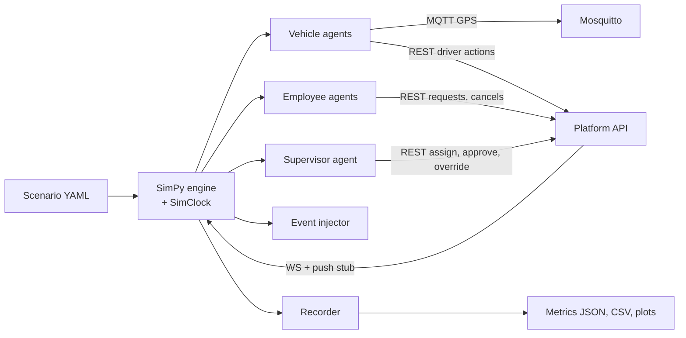

# Simulator specification

A closed-loop, software-in-the-loop simulator (like ArduPilot SITL). The platform under test is **unchanged** and talks to simulated agents through its normal REST API, WebSocket and MQTT interfaces.

## 1. Goals
- Test every phase's logic end to end before live use.
- Compare dispatch policies and config values with identical inputs (same seed).
- Estimate capacity (how many cabs a client needs).
- Replay real days (after Phase 1) for validation and sales demos.
- Generate synthetic data for early Phase 4 model development.

Non-goals: proving human adoption; high-fidelity traffic physics (SUMO is a later option).

## 2. Architecture


Package layout (`simulator/`):
```
simulator/
  sim/engine.py          # SimPy environment, clock sync
  sim/clock.py           # drives backend /simctl/clock
  sim/agents/vehicle.py
  sim/agents/employee.py
  sim/agents/supervisor.py
  sim/traffic.py
  sim/events.py
  sim/routing.py         # OSRM client (same instance as platform)
  sim/platform_client.py # REST + WS client (uses the generated Python client or httpx)
  sim/mqtt_client.py
  sim/recorder.py
  sim/metrics.py
  sim/cli.py             # `python -m sim run scenarios/normal_weekday.yaml`
  scenarios/*.yaml
  tests/
```

## 3. Time
- The simulator owns time. `SimClock` advances in steps (default 1 s simulated) and calls `PUT /simctl/clock` so the backend's `Clock` matches.
- Speed factor configurable: `1` (real time, for watching on the map), up to `60`+ (as fast as the backend keeps up). The simulator waits for the backend to process due jobs (failsafe, expiry, ETA refresh) at each step: `POST /simctl/tick` is implied by the clock PUT (backend runs due scheduled work synchronously in sim mode).
- All agent timings are in simulated seconds.

## 4. Road network and movement
- Uses the same OSRM instance and OSM data as the platform.
- A vehicle following a route moves along the OSRM route geometry; its speed per segment = OSRM speed × traffic factor × noise (lognormal, σ = 0.15).
- GPS ping generation: position along route + Gaussian noise (σ = 5 m), interval per `mqtt-topics.md` rules; optional ping loss rate.

## 5. Agents

### 5.1 Vehicle / driver agent
Behaviour:
- Goes on duty at shift start (`POST /driver/duty`), off at shift end if no active trip.
- Receives assignments via WebSocket (`trip.assigned`) — acceptance delay ~ Uniform(5, 60) s.
- Drives to each stop in order; at stop: `arrived`, waits for rider agent (boarding delay ~ Uniform(30, 120) s), then `done`; or `no_show` after `no_show_wait_minutes` if rider absent.
- Idle behaviour: stays at last drop location (Phase 1–3); Phase 4 option: return to a depot/hotspot.
- Faults (probabilities per scenario): late duty start, breakdown mid-trip (`/driver/issues`), GPS dropout of N minutes, network offline (buffer + batch).

### 5.2 Employee agent
Attributes from scenario: home point (sampled within zones or from a list), office, priority, VIP, urgency distribution, opt-out.
- **Demand model:**
  - `to_office`: request created at `shift_start − lead_time`, lead_time ~ Normal(45, 10) min; requested pickup time = shift_start − travel_buffer.
  - `from_office`: ready time ~ Normal(shift_end + μ_late, σ) with μ_late default 10 min, σ 15 min; request at ready time.
  - Daily participation probability (e.g. 0.8).
- Readiness at pickup: present on time with p = 0.9; late by Exp(3 min) otherwise; no-show p = 0.02.
- Cancels if waiting > patience ~ Normal(40, 10) min (records "gave up" in metrics).
- Phase 4: accepts offers with probability based on time difference and pooling (logistic model, parameters in scenario).

### 5.3 Supervisor agent
Policies (per scenario):
- `manual_nearest`: assigns the candidate with lowest ETA after reaction delay ~ Uniform(20, 120) s; handles one request at a time (models the human bottleneck).
- `approve_all`: approves top suggestion after delay (Phase 2).
- `mixed`: approves with p, overrides with (1 − p) choosing second candidate, reason `local_knowledge`.
- `absent`: never responds (tests failsafe).
- Shift gaps: off duty periods to simulate lunch/night.

## 6. Traffic model
- Time-of-day factors per road class (motorway, primary, secondary, residential): factor table in scenario, e.g. 08:00–10:30 and 17:30–20:30 → 0.6 on primary roads.
- Event overrides: rain (all × 0.7), road closure (edge list → infinite cost via OSRM exclusion or detour penalty in sim movement only).
- After Phase 1: factors fitted from real `road_speed_profile`.

## 7. Event injector
Timed events in the scenario: `rain`, `road_closure`, `demand_surge` (extra requests), `vehicle_breakdown` (specific or random vehicle), `gps_loss`, `supervisor_absent`, `optimizer_down` (sim toggles a backend flag), `vip_burst`.

## 8. Scenario file format (YAML)
```yaml
name: normal_weekday
version: 1
seed: 42
start: "2026-10-05T00:30:00Z"     # 06:00 IST
duration_hours: 16
speed_factor: 60
operator:
  config_overrides:
    alert_wait_minutes: 20
modes:
  - {mode: manual}                 # operator default
fleet:
  - {type: sedan_4, count: 25, depot: [28.5355, 77.3910]}
  - {type: suv_6, count: 8, depot: [28.5355, 77.3910]}
  - {type: vip, count: 2, depot: [28.5355, 77.3910]}
drivers:
  shift_start_ist: "06:00"
  shift_end_ist: "22:00"
  late_start_p: 0.05
clients:
  - name: Client A
    office: {name: B200, location: [28.5703, 77.3218]}
    employees:
      count: 300
      home_zones: [sector_135, sector_168, sector_62]
      vip_share: 0.01
      priority_dist: {1: 0.02, 3: 0.08, 5: 0.8, 8: 0.1}
      shifts:
        - {start_ist: "09:30", end_ist: "18:30", share: 0.8}
        - {start_ist: "13:00", end_ist: "22:00", share: 0.2}
supervisor:
  policy: manual_nearest
  reaction_delay_s: [20, 120]
traffic:
  profile: ncr_default
events:
  - {at_ist: "18:00", type: rain, duration_min: 90}
  - {at_ist: "10:15", type: vehicle_breakdown, vehicle: random}
assertions:
  p90_wait_minutes_max: 30
  gave_up_max: 5
  invalid_transitions: 0
```

## 9. Metrics recorded
Per run (JSON + CSV): requests, assigned, dropped, cancelled, gave up, no-shows, expired; wait (median, p90, max) overall and by direction/client/priority; ETA error (median, p90); vehicles used; trips; riders per trip; km total and empty km share; supervisor actions count and time; suggestion acceptance; failsafe triggers; override count; hard-rule violations (must be 0); invalid state transitions (must be 0); API errors; backend latency percentiles.

## 10. Outputs and visualization
- `runs/<timestamp>_<scenario>/metrics.json`, `requests.csv`, `trips.csv`, `pings.csv`, `summary.md`, plots (wait histogram, vehicles in use over time).
- Live view: point the supervisor app (or Flutter web build) at the sim backend to watch cabs move at `speed_factor: 1–5`.
- Compare mode: `python -m sim compare runA runB` → table of metric deltas.

## 11. Replay mode (Phase 1+)
Load real requests and vehicle shifts from an exported day; replay with a chosen policy; compare against what actually happened.

## 12. CI integration
- `make sim-quick`: 3 short scenarios (1 hour sim time each), on every pull request touching `backend/` or `simulator/`.
- `make sim-full`: full suite nightly and before each release. Any failed assertion blocks release.

## 13. Determinism
Same scenario + seed + platform version → same results (within tolerance for timing-sensitive metrics). Random draws use a per-agent `numpy.random.Generator` seeded from the scenario seed and agent id.
