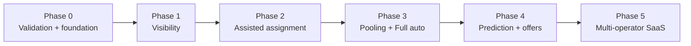

# Roadmap

Six phases. Each phase ships to a live pilot operator and must pass its simulator scenarios (`scenarios.md`) before going live. Durations assume 1–2 part-time developers with AI agents and will be revised after Phase 0.

## Phase 0 — Validation + foundation (2–4 weeks)
Business:
- Interview operator owner, dispatcher, 3–5 drivers, 3–5 employees (question list in `docs/07-decisions/open-questions.md` appendix).
- Log 10–15 own trips: request time, reply time, actual pickup, drop.
- Collect one week of request data from the operator (WhatsApp exports or register).
- Confirm pilot operator, number of cabs/clients/trips, iPhone share among employees, night-safety policies.
- Check employment terms if the pilot involves own employer.
Engineering (tasks F-xx, M-01..M-03 in `phase-1-tasks.md`):
- Repo, CI, infra compose, map data, skeleton backend and app, simulator v0.
**Exit:** pilot operator agreed; baseline wait metrics measured; foundation tasks done.

## Phase 1 — Visibility (8–10 weeks)
Scope: login (OTP), roles, admin data (fleet, clients, offices, employees + CSV import), ride requests, manual assignment, trips and driver flow, GPS via MQTT, live tracking with ETA, push notifications, supervisor live map + pending queue with timers, alerts (SOS, driver issues, expiry, stale GPS), emergency pause switch, basic reports, simulator driving the full API.
Modes: `manual` only.
**Exit:** pilot runs all trips through the system for 4 weeks; "where is my cab?" calls sharply reduced; S01–S07 pass (S07 in manual form).

## Phase 2 — Assisted assignment (6–8 weeks)
Scope: rules engine (hard rules), cost scoring and suggestions with reasons, `semi_auto` mode, mode settings per scope, zones, full override set with impact preview and reasons, failsafe, client policies, supervisor/admin Flutter web build, Hindi strings, simulated supervisor policies.
**Exit:** suggestion acceptance > 70%; supervisor time per request reduced vs Phase 1; S08–S09 pass.

## Phase 3 — Pooling + Full auto (8–12 weeks)
Scope: OR-Tools batch optimizer (DARP), micro-batching, evening hold window, en-route reuse, `full_auto` per scope, mode-switch prompts, degradation fallbacks, learned speed profiles into OSRM, billing export, full reports, policy comparison runs.
**Exit:** cab-km per trip and vehicles used reduced vs baseline; median wait reduced; full auto running on ≥ 1 scope; S10–S12 pass.

## Phase 4 — Prediction + offers (8–12 weeks)
Scope: ready-time and zone-demand models, dynamic hold window, proactive ride offers with accept/reject, learning from override logs, simulated offer behaviour.
**Exit:** offer acceptance > 40% in pilot; prediction error acceptable for dispatch; S13 passes.

## Phase 5 — Multi-operator SaaS (ongoing)
Scope: operator self-onboarding, subscription billing, iOS release, analytics benchmarks, HRMS/attendance integrations, ESP32 tracker option, scaling (ingestor in Go if needed, Kubernetes if needed).
**Exit:** 3+ paying operators onboarded without custom work; S14 passes.

## What each phase hands to the next
- Phase 1 trip logs → real ETAs, wait baselines, demand patterns, simulator calibration.
- Phase 2 override logs → local knowledge to tune Phase 3 weights and rules.
- Phase 3 pooled trips → labelled outcomes for Phase 4 models.
- Phase 4 accept/reject data → per-rider behaviour for offers and pooling.
